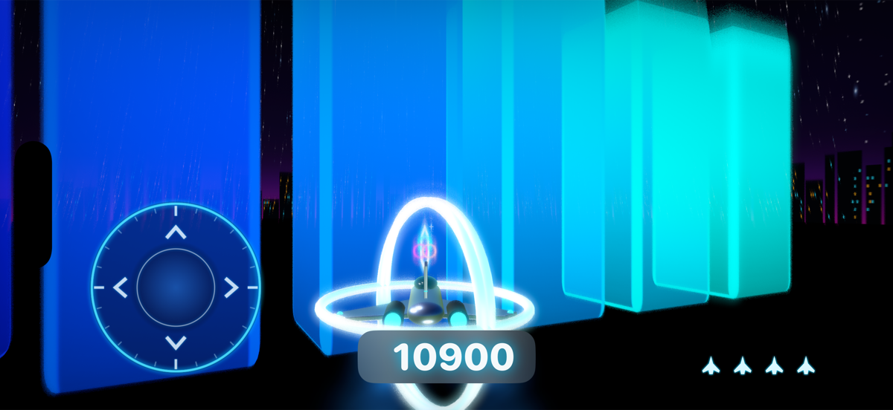
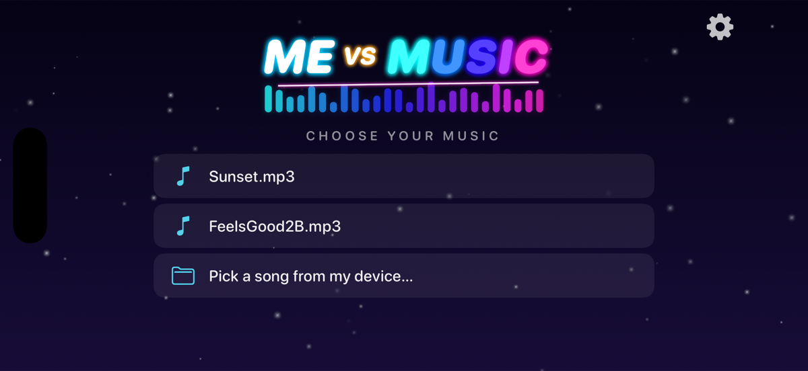
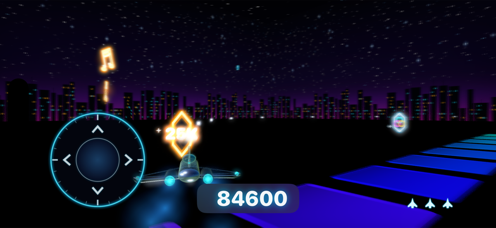
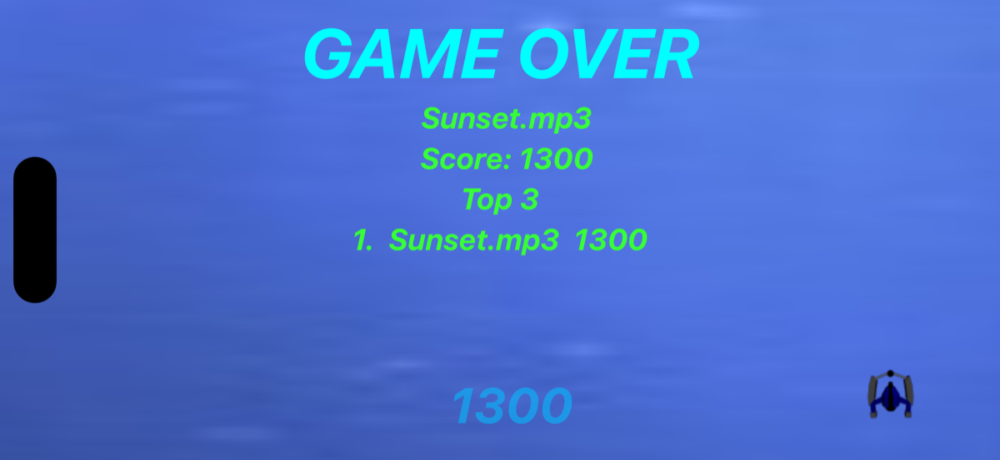
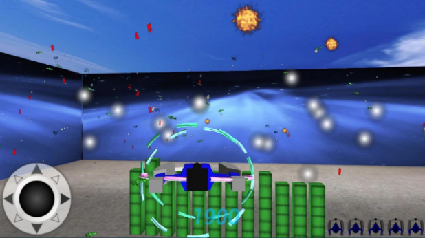
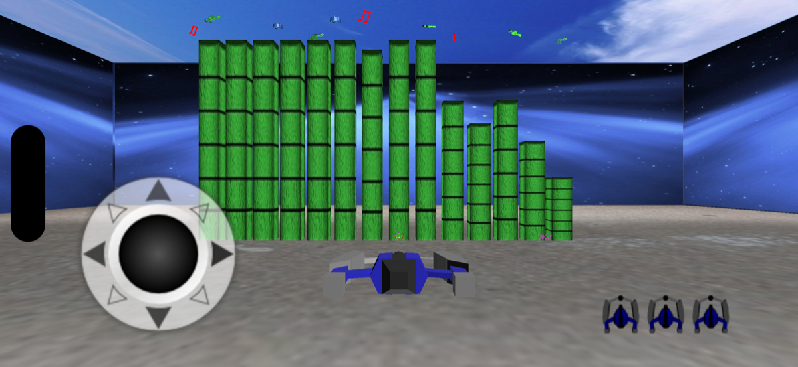

# MeVsMusic for iOS

Fly your ship against the spectrum of your own music.

A native Swift port of [MeVsMusic](https://github.com/rai2270/MeVsMusic), the 2012 Android game built for a Samsung contest — rebuilt for iOS with SceneKit and AVFoundation, no third-party dependencies.

*Live gameplay — every bar is the song's spectrum, and the chords bursting out of it are yours to shoot.*

*The ring weapon — grab the rings pickup and every shot becomes a volley at all the chords ahead of you.*

| Choose your music | Play against it | Beat your top 3 |
|:--:|:--:|:--:|
|  |  |  |

## The game

Pick any song. Its live frequency spectrum becomes a wall of dancing bars inside the arena — and every time the music slams a bar to its peak, a **chord** bursts out of it and hunts your ship. Shoot the chords, dodge the ones you miss, and grab the pickups floating over the spectrum: a ring weapon that volleys fast aimed shots at every chord ahead, an extra ship, and score bonuses. When the song ends, the run ends — your score goes up against your top 3.

Louder, busier music means more enemies. Choose your songs accordingly.

## One game, three eras

| 2012 — the Android original | The faithful port (v1.0–1.1) | The redesign (v1.2) |
|:--:|:--:|:--:|
|  |  |  |
| Rajawali/OpenGL, point sprites | same art, rebuilt on SceneKit | all-new art, HDR neon skyline |

The middle step is the whole porting story: every texture, model and timing constant carried over from 2012 while the engine underneath became SceneKit and AVFoundation — [How MeVsMusic was ported from Android to iOS](docs/PORTING.md) walks through it. Version 1.2 then replaced every asset with new art. What has never changed is the game itself: all three screenshots are running the same rules — scoring, spawning, collisions — ported line-for-line from `GameLogic.java`.

Each era is a tagged [release](https://github.com/rai2270/mevsmusic-ios/releases): [v1.0](https://github.com/rai2270/mevsmusic-ios/releases/tag/v1.0) is the first faithful port, [v1.1](https://github.com/rai2270/mevsmusic-ios/releases/tag/v1.1) adds the high-quality graphics pass, and [v1.2](https://github.com/rai2270/mevsmusic-ios/releases/tag/v1.2) is the redesign.

## Controls

- **Pad (bottom-left)** — steer: left/right turns, up/down climbs and dives. Touching the pad also fires.
- **Tap anywhere else** — 30 seconds of autofire.
- **Accelerometer** — optional tilt steering; toggle it by tapping the logo on the song menu.

Music can come from the two bundled demo tracks, your music library, or any audio file in the Files app (MP3, M4A/AAC, WAV, AIFF — anything Core Audio decodes). Streaming/DRM Apple Music tracks can't be decoded by third-party apps and are filtered out of the list.

## How the port is built

The Android original carried its own OpenGL engine and a licensed audio library. The iOS port keeps the game and replaces the machinery:

| | Android (2012) | iOS |
|---|---|---|
| Rendering | Rajawali (OpenGL ES 2.0) | SceneKit |
| Audio + FFT | BASS (`BASS_DATA_FFT1024`) | AVAudioEngine tap + Accelerate (vDSP) |
| Game rules | `GameLogic.java` | `GameLogic.swift` — pure Swift, no UIKit/AV imports |
| Frame loop | `FlyingRenderer.java` | `GameRenderer.swift` (`SCNSceneRendererDelegate`) |
| Particles | GL point-sprite systems | CPU-driven billboarded planes |
| Screens | `MeVsMusicActivity` / `FlyingActivity` | `MenuViewController` / `GameViewController` |

The rules layer crossed over almost line for line: scoring, lives, the bonus spawner, spectrum smoothing, chord-release timing and the game-over sequence all live in a platform-free `GameLogic` that knows nothing about rendering or audio.

The audio path mirrors BASS's semantics: a tap on the player keeps the most recent 1024 samples, and the game polls a Hann-windowed FFT on a 20 ms timer, folding 512 magnitude bins into the 26 frequency bands the game was tuned around (the top 14 are the bars you see). The one number BASS didn't bring along — its magnitude scale — was recovered empirically: an offline harness decoded both demo tracks through the real game rules and swept normalization constants until the chord-spawn rate matched the busy feel of the Android original.

📖 **Want the full story?** [How MeVsMusic was ported from Android to iOS](docs/PORTING.md) is a plain-language walkthrough of every step — replacing the 3D engine and audio library, keeping the game rules pixel-faithful, and how each piece was verified.

## Building

Open `mevsmusic.xcodeproj`, select the **mevsmusic** scheme, and run. That's it — no packages, no pods.

- Xcode 16 or newer, iOS 17 deployment target, landscape only.
- Music-library access is requested only for listing your songs; the demo tracks and Files picker work without it.
- **Demo autopilot** (screenshots/trailers): launch with the `DEMO` environment variable set (Xcode scheme, or `SIMCTL_CHILD_DEMO=1 xcrun simctl launch ...`) and the game starts the bundled track by itself, flies toward pickups and autofires. Unreachable in normal use — it only activates through that variable.

## Credits

- Original game, design and reference implementation: [rai2270/MeVsMusic](https://github.com/rai2270/MeVsMusic)
- Demo songs: [Audionautix](https://audionautix.com)
